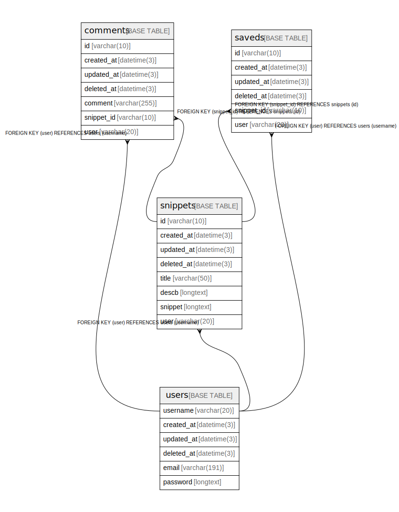

# twilux

## Tables

| Name | Columns | Comment | Type |
| ---- | ------- | ------- | ---- |
| [comments](comments.md) | 7 |  | BASE TABLE |
| [saveds](saveds.md) | 6 |  | BASE TABLE |
| [snippets](snippets.md) | 8 |  | BASE TABLE |
| [users](users.md) | 6 |  | BASE TABLE |

## Relations

---

> Generated by [tbls](https://github.com/k1LoW/tbls)
