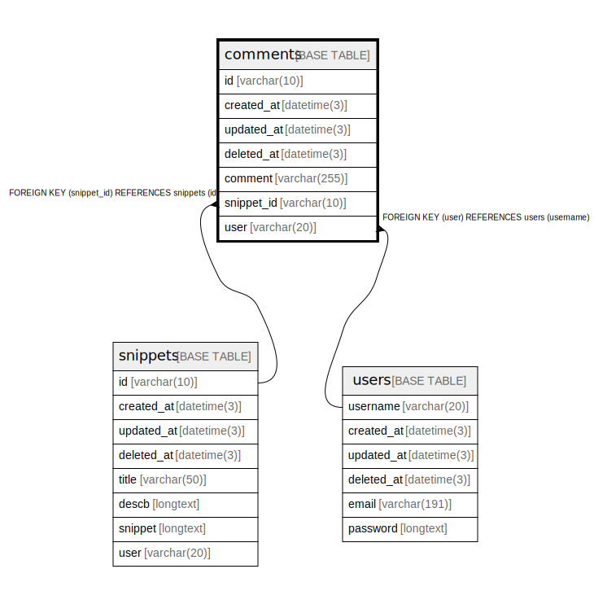

# comments

## Description

<details>
<summary><strong>Table Definition</strong></summary>

```sql
CREATE TABLE `comments` (
  `id` varchar(10) NOT NULL,
  `created_at` datetime(3) DEFAULT NULL,
  `updated_at` datetime(3) DEFAULT NULL,
  `deleted_at` datetime(3) DEFAULT NULL,
  `comment` varchar(255) DEFAULT NULL,
  `snippet_id` varchar(10) NOT NULL,
  `user` varchar(20) NOT NULL,
  PRIMARY KEY (`id`),
  KEY `idx_comments_deleted_at` (`deleted_at`),
  KEY `idx_comments_snippet_id` (`snippet_id`),
  KEY `idx_comments_user` (`user`),
  CONSTRAINT `fk_comments_snippet` FOREIGN KEY (`snippet_id`) REFERENCES `snippets` (`id`),
  CONSTRAINT `fk_comments_user_info` FOREIGN KEY (`user`) REFERENCES `users` (`username`)
) ENGINE=InnoDB DEFAULT CHARSET=utf8mb4
```

</details>

## Columns

| Name | Type | Default | Nullable | Children | Parents | Comment |
| ---- | ---- | ------- | -------- | -------- | ------- | ------- |
| id | varchar(10) |  | false |  |  |  |
| created_at | datetime(3) | NULL | true |  |  |  |
| updated_at | datetime(3) | NULL | true |  |  |  |
| deleted_at | datetime(3) | NULL | true |  |  |  |
| comment | varchar(255) | NULL | true |  |  |  |
| snippet_id | varchar(10) |  | false |  | [snippets](snippets.md) |  |
| user | varchar(20) |  | false |  | [users](users.md) |  |

## Constraints

| Name | Type | Definition |
| ---- | ---- | ---------- |
| fk_comments_snippet | FOREIGN KEY | FOREIGN KEY (snippet_id) REFERENCES snippets (id) |
| fk_comments_user_info | FOREIGN KEY | FOREIGN KEY (user) REFERENCES users (username) |
| PRIMARY | PRIMARY KEY | PRIMARY KEY (id) |

## Indexes

| Name | Definition |
| ---- | ---------- |
| idx_comments_deleted_at | KEY idx_comments_deleted_at (deleted_at) USING BTREE |
| idx_comments_snippet_id | KEY idx_comments_snippet_id (snippet_id) USING BTREE |
| idx_comments_user | KEY idx_comments_user (user) USING BTREE |
| PRIMARY | PRIMARY KEY (id) USING BTREE |

## Relations



---

> Generated by [tbls](https://github.com/k1LoW/tbls)
