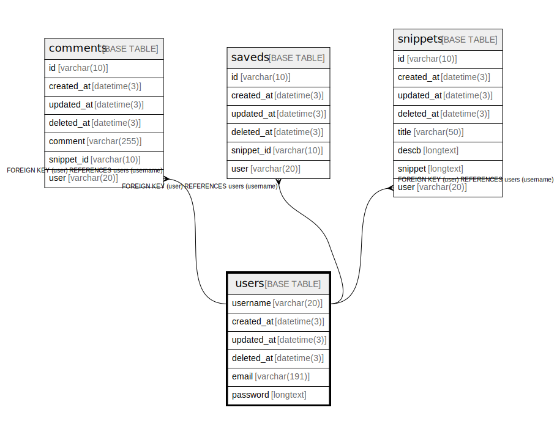

# users

## Description

<details>
<summary><strong>Table Definition</strong></summary>

```sql
CREATE TABLE `users` (
  `username` varchar(20) NOT NULL,
  `created_at` datetime(3) DEFAULT NULL,
  `updated_at` datetime(3) DEFAULT NULL,
  `deleted_at` datetime(3) DEFAULT NULL,
  `email` varchar(191) NOT NULL,
  `password` longtext NOT NULL,
  PRIMARY KEY (`username`),
  UNIQUE KEY `username` (`username`),
  UNIQUE KEY `email` (`email`),
  KEY `idx_users_deleted_at` (`deleted_at`)
) ENGINE=InnoDB DEFAULT CHARSET=utf8mb4
```

</details>

## Columns

| Name | Type | Default | Nullable | Children | Parents | Comment |
| ---- | ---- | ------- | -------- | -------- | ------- | ------- |
| username | varchar(20) |  | false | [comments](comments.md) [saveds](saveds.md) [snippets](snippets.md) |  |  |
| created_at | datetime(3) | NULL | true |  |  |  |
| updated_at | datetime(3) | NULL | true |  |  |  |
| deleted_at | datetime(3) | NULL | true |  |  |  |
| email | varchar(191) |  | false |  |  |  |
| password | longtext |  | false |  |  |  |

## Constraints

| Name | Type | Definition |
| ---- | ---- | ---------- |
| email | UNIQUE | UNIQUE KEY email (email) |
| PRIMARY | PRIMARY KEY | PRIMARY KEY (username) |
| username | UNIQUE | UNIQUE KEY username (username) |

## Indexes

| Name | Definition |
| ---- | ---------- |
| idx_users_deleted_at | KEY idx_users_deleted_at (deleted_at) USING BTREE |
| PRIMARY | PRIMARY KEY (username) USING BTREE |
| email | UNIQUE KEY email (email) USING BTREE |
| username | UNIQUE KEY username (username) USING BTREE |

## Relations



---

> Generated by [tbls](https://github.com/k1LoW/tbls)
